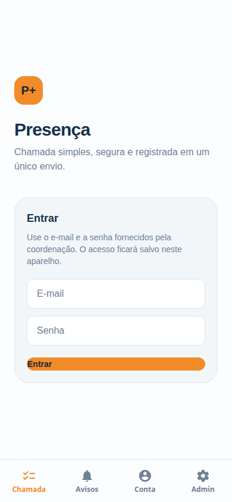
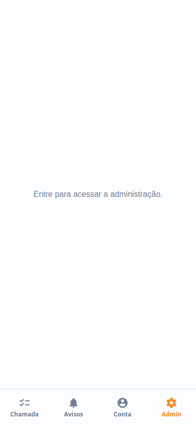
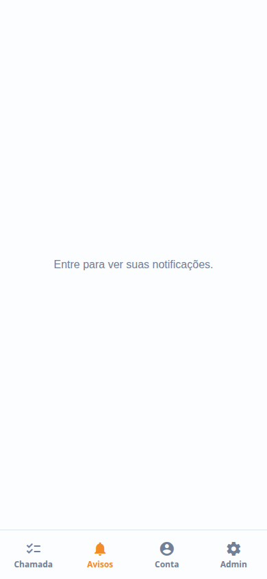
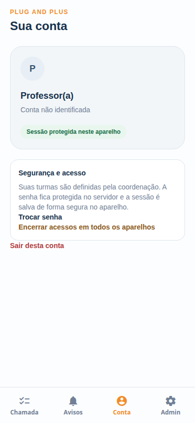

# Capturas do aplicativo

As imagens desta pasta foram capturadas da prévia web do Plug Presença em viewport mobile de 390 × 844 px. Elas servem para apresentação do conceito e da interface, não substituem o teste em Android/iOS instalado.

## Entrada

A tela inicial demonstra o login por e-mail e senha, a identidade visual Plug and Plus e a navegação inferior.

## Área administrativa bloqueada

A área administrativa exige autenticação e perfil autorizado.

## Avisos

A caixa interna reúne confirmações, erros de sincronização e avisos da coordenação.

## Conta

A tela de conta apresenta a sessão protegida no aparelho, a troca de senha e o encerramento de acessos.

As telas foram capturadas sem credenciais reais e não exibem dados pessoais de alunos ou professores.
